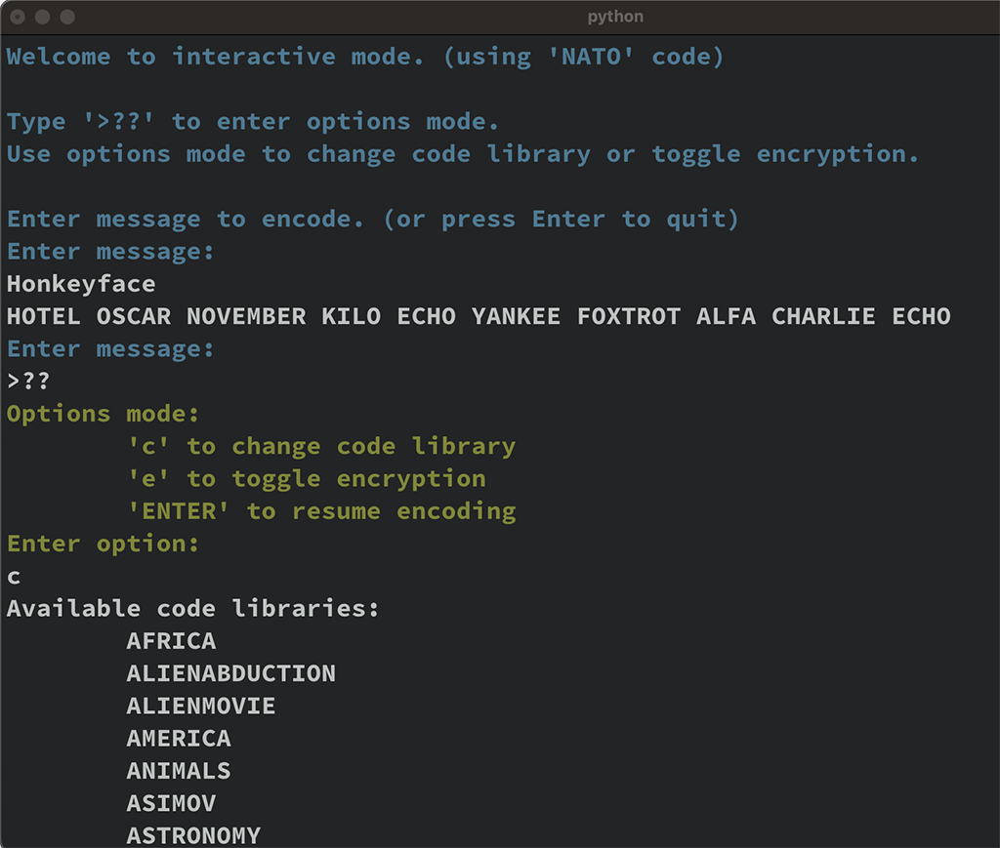
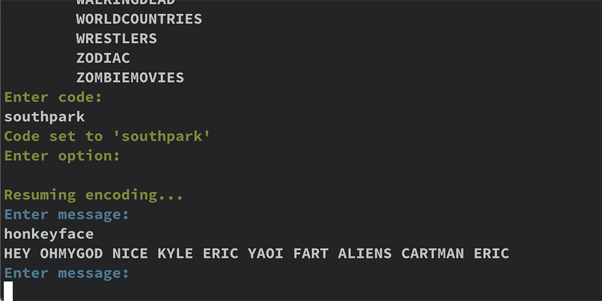
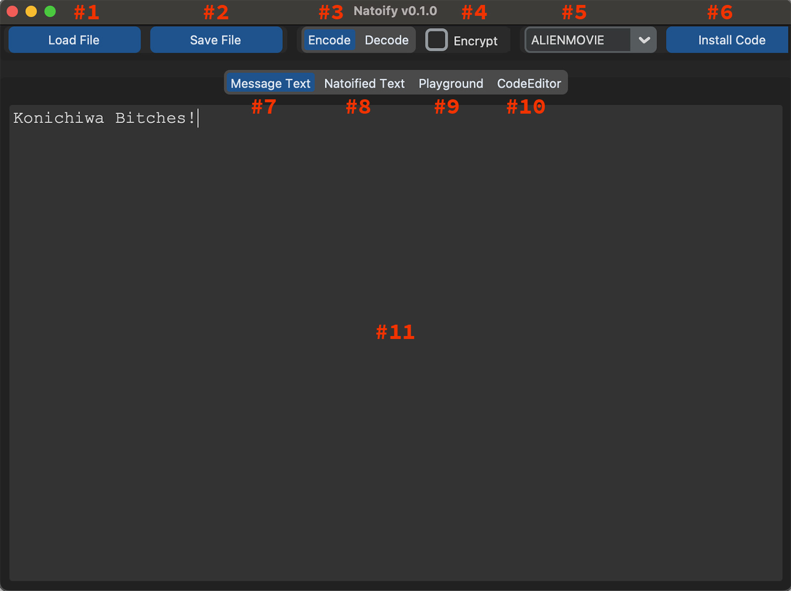
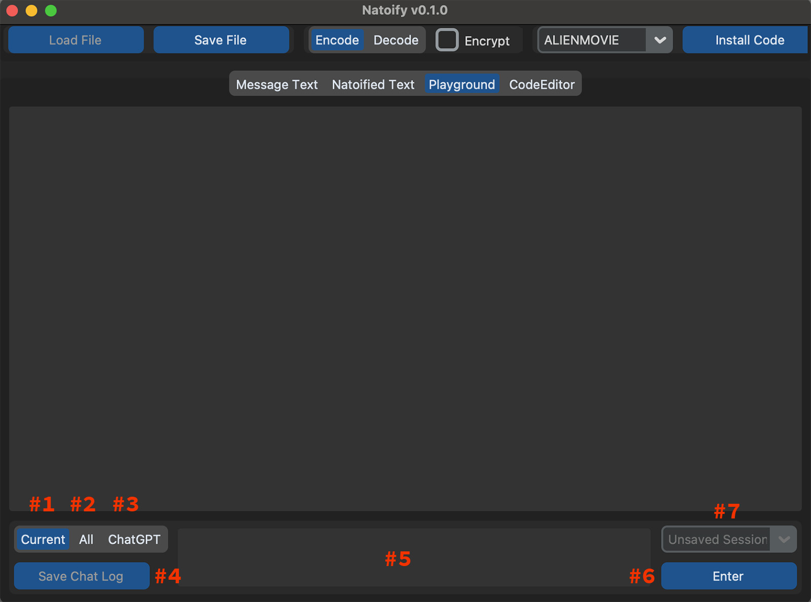
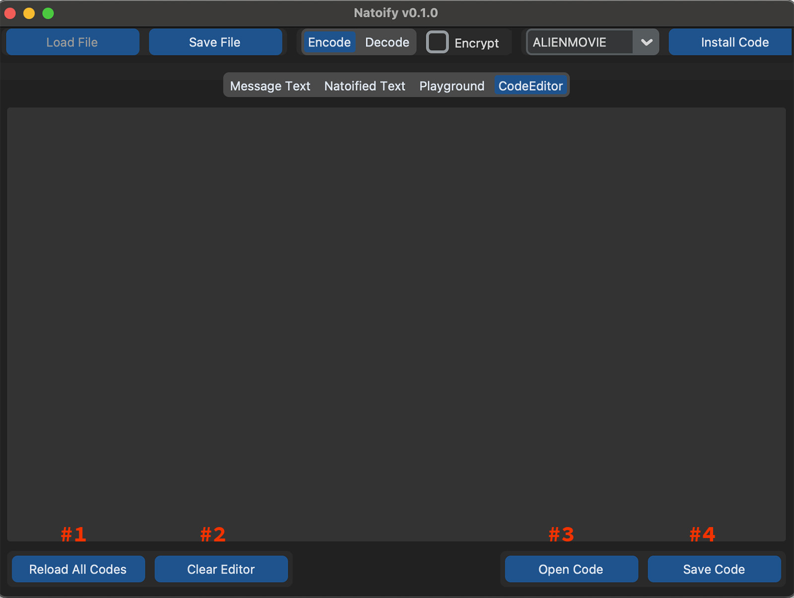

# Tutorials

## Using natocli

Most of what you need to know can be found in the cli help (`--help`).

Basic usage is described in the [README](README.rst). One thing to note is that it's set up to take in a stream from stdin, like piping | a programs output into natocli. Because of this, if you run it without any options or args, it can seem to hang as it's waiting for input. Ctrl+D(CMD+D) will break you out of the waiting loop.
```sh
  natocli    # no options or args ctrl(cmd)+D to quit
```

You can be more explicit about what you're doing by using the `-` options
```sh
  natocli - -     # same as above
```

Use `-m` `--message` for input and `-o` `--output` for output file names
```sh
  natocli -m input.txt -o output.txt
```

Use `-d` `--decode` for decoding mode and `-e` `--encrypted` for encrypting/decrypting mode
```sh
  natocli -m input.txt -o output.txt -d -e
```

Use `-c` `--code` for specifying the code library to be used in encoding/decoding
```sh
  natocli -m input.txt -o output.txt -c "CONANBARBARIAN"
```


Use `-l` or `--list-codes` to list all available codes. Codes are stored in the package dir (natoify/code_lib).
```sh
  natocli -l
```

Use `-r` or `--repl` to enter interactive mode. Enter text and the encoded text is displayed. Pressing `Enter` without input text will end the program.
```sh
  natocli -r
```

In interactive mode, entering `>??` will put you in options mode where you can change the active code `c` or toggle encryption `e` to view the results. Entering `c` will print a list of available codes to choose from. Pressing `Enter` without input text will exit options mode and you can resume entering text to encode.






## Using natoapp

Starting it if you've installed it using pip:
```sh
  natoapp
```

Starting it if working from the projects /src folder: (a git clone or zip download)
```sh
  python -m natoify.natoapp
```



The main screen of the NatoAPP. Load a text file, adjust your settings, and encode/decode.

1. Load files into the Message Text tab.
2. Save files from the active tab's text area.
3. Encode/Decode toggle buttons
4. Encryption/Decryption toggle
5. Available code libraries dropdown. Selected code is used to encode/decode.
6. Install Code. Opens file browser and saves file to the default code dir.
7. Message Text tab. Text to be encoded/decoded.
8. Natoified Text tab. Result of encoding/decoding.
9. Playground tab. See screenshot below. For testing codes individually or all at once. Also home to the ChatGPT functionality.
10. CodeEditor tab. Load code json files from the default natoify/code_lib dir, edit, and save or rename. A place to cut/paste and edit output from ChatGPT.
11. Text edit area. Each tab has it's own text area.




The playground is where you type into the entry area (#5) and press enter. This can be for experimenting with one code, using all codes on one word or sentence, or yaking with ChatGPT.

1. Current. Uses the currently selected code in the dropdown to encode/decode when pressing the Enter button.
2. All. Encodes/decodes the entry text with all available code libraries. Great for pondering your options.
3. ChatGPT. If you have your api key installed (see [README](README.rst)) you can chat it up with that clever AI. Note that it's not the smooth Web3 experience you're used to but it works well. Chat sessions are not logged automatically so, if you want to save a session when you're done, click the Save Chat Log (#4) and a json file will be saved to the default directory (natoify/chat_log).
4. Save Chat Log. As described above. Saves a json file that can be loaded later from #7 to continue a conversation.
5. Text entry area.
6. Enter button. Executes encoding/decoding or sends prompt to ChatGPT.
7. Chat Session Selector. Saved sessions can be reloaded for review or continued. Note that as sessions get longer, they must be truncated to stay within the token limit of our chatty buddy. Saving and loading sessions with #4 and #7 stores the complete session which is then truncated in the background to continue a chat. At any time you can use the Save File button in the upper left to save the contents any active tab's text area to a directory of your choosing. The chat selector and save chat log maintain the json version of a session behind the scenes.




The CodeEditor is a place to work on the raw json files that make up the code library. View them, edit them, save your own versions, or copy/paste from the chat window for clean up. Buttons open and save from the default code directory (natoify/code_lib).

1. Reload All Codes. This forces a full reload of all code files in the code_lib directory. Necessary after installing or saving new files there. Reload and they will appear in the code selector dropdown for use.
2. Clear Editor. Quickly make space for the next cut/paste.
3. Open Code. Opens a file picker dialog already preset to the natoify/code_lib dir.
4. Save Code. Saves the contents of the text area to a file. File picker is preset to the natoify/code_lib dir.

That's pretty much it. Play with it for a bit and you'll figure it out. It's not high tech but it does the job and everything you need is in one place. Enjoy!

